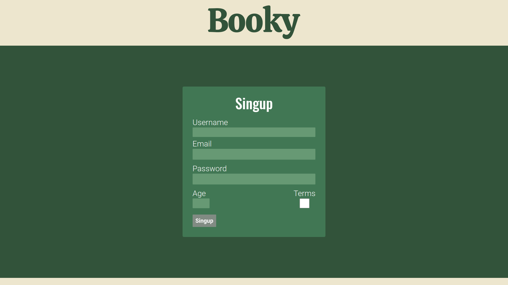

<h1 align="center">
    Documentación de Booky
</h1>

<p align="center"><a target="_blank"></a></p>

## Índice

- [Introducción](#introducción)
  - [Expectativas/Objetivos](#expectativasobjetivos)
  - [Antecedentes](#antecedentes)
- [Descripción del Resultado Obtenido](#descripción-del-resultado-obtenido)
  - [Funcionalidades Clave](#funcionalidades-clave)
  - [Otros Aspectos Relevantes](#otros-aspectos-relevantes)
- [Instalación](#instalación)
- [Guía de estilos y prototipado](#guía-de-estilos-y-prototipado)
  - [Estilos CSS](#estilos-css)
  - [Colores](#colores)
  - [Fuentes](#fuentes)
  - [Estilos Generales](#estilos-generales)
  - [Prototipado](#prototipado)
  - [Mockups](#mockups)
- [Desarrollo](#desarrollo)
- [Dificultades Encontradas y Decisiones Afrontadas](#dificultades-encontradas-y-decisiones-afrontadas)
- [Despliegue: Tecnología y Proceso](#despliegue-tecnología-y-proceso)
  - [Proceso de Despliegue](#proceso-de-despliegue)
- [Conclusiones](#conclusiones)

### Introducción

En un mundo donde el tiempo es un recurso cada vez más escaso, la búsqueda de la próxima lectura perfecta puede resultar una tarea abrumadora. Ante esta realidad, surge la necesidad de una solución que simplifique y agilice este proceso para los amantes de la lectura. Es en este contexto que se presenta **Booky**, una aplicación web diseñada para facilitar la búsqueda, selección y organización de libros y revistas. Con Booky, cualquier persona puede explorar una amplia variedad de obras literarias, recibir recomendaciones personalizadas y conectarse con una comunidad de lectores afines.

#### Expectativas/Objetivos

El objetivo principal de Booky es proporcionar a los usuarios una plataforma intuitiva y eficiente para descubrir nuevas lecturas de manera fácil y rápida.

1. **Desarrollo de una interfaz de usuario amigable:** Ofrecer una UX fluida y atractiva, donde los usuarios puedan navegar de manera sencilla y encontrar la información que necesitan con facilidad.
2. **Implementación de funcionalidades clave:** Características esenciales como búsqueda por título, filtros de relevancia, registro de usuarios, almacenamiento de favoritos, comentarios sobre libros y participación en grupos de lectura.
3. **Integración de tecnologías modernas:** Se utiliza Vue.js para la creación del frontend, Laravel para el desarrollo del backend y Docker para el despliegue del proyecto, garantizando así un desarrollo eficiente y escalable.
4. **Feedback y mejora continua:** Recopilar el feedback de los usuarios y utilizarlo para realizar mejoras continuas en la aplicación, asegurando que satisfaga las necesidades y expectativas de su audiencia.

#### Antecedentes

Como lector me he visto en el problema de tener que buscar en diferentes sitios mis próximos libros y pensé en que la solución sería crear una plataforma que tuviera todos los títulos posibles. Para evitar redundancias por usar diferentes buscadores. Tomando como inspiración productos ya creados como Goodreads o LibraryThing.

### Descripción del Resultado Obtenido

Booky es una aplicación web que ofrece una serie de funcionalidades para simplificar y mejorar la experiencia de búsqueda, selección y organización de libros y revistas.

#### Funcionalidades Clave:

1. **Búsqueda de libros por título:** Los usuarios pueden buscar fácilmente libros y revistas por su título, lo que les permite encontrar rápidamente obras de su interés.
2. **Filtros de libro o revista:** Diferenciar entre libro o revista a la hora de filtrar.
3. **Filtro por relevancia o novedad:** Diferenciar entre relevante o nuevo a la hora de filtrar.
4. **Registro de usuarios:** Para acceder a todas las funcionalidades de Booky, los usuarios deben registrarse, lo que les permite guardar lecturas preferentes y participar en la comunidad.
5. **Favoritos:** Una vez registrados, los usuarios pueden guardar lecturas deseadas en su lista de favoritos para acceder fácilmente a ellas en el futuro.
6. **Información detallada de los libros:** Booky proporciona información detallada sobre cada libro o revista, incluyendo sinopsis, información del autor y comentarios de otros usuarios.
7. **Comentarios sobre libros:** Los usuarios pueden compartir sus opiniones y comentarios sobre las lecturas en el apartado de información de cada libro, lo que permite a otros usuarios tomar decisiones informadas sobre qué leer.
8. **Grupos de lectura:** Booky ofrece la posibilidad de unirse a grupos de lectura sobre diferentes temáticas, donde los usuarios pueden discutir y compartir recomendaciones con otros miembros de la comunidad.

#### Otros Aspectos Relevantes:

* La aplicación se ha desarrollado utilizando tecnologías modernas como Vue.js para el frontend, Laravel para el backend y Docker para el despliegue, lo que garantiza un desarrollo eficiente y escalable.
* Se ha probado la aplicación para garantizar la calidad y estabilidad de la aplicación antes de su lanzamiento.
* Atento al feedback de los usuarios y en la evolución de las tecnologías y tendencias del mercado.

### Instalación

Lanzar antes el [backend](https://github.com/F0rno/DWES-Proyecto-6) y luego:

```.env
VITE_API_URL=http://localhost/api
VITE_TOKEN_KEY=Primado negativo
```

```bash
npm install && npm run build && npm run preview
```

### Guía de estilos y prototipado

#### Estilos CSS

Los estilos están integrados en los componentes con la propiedad scoped, haciendo que estos solo se apliquen a los elementos HTML del propio componente. A pesar de esto, se sigue utilizando BEM para referirse a los estilos y mantener la semántica.

Para los estilos globales, que básicamente son reseteos de propiedades genéricas y variables. Se utiliza el archivo [style.css](https://github.com/F0rno/DWEC-Proyecto-6/blob/master/src/style.css). Se utiliza solo CSS puro.

#### Colores

* **Verde Claro:** #ECE3CE
* **Verde Medio:** #739072
* **Verde Oscuro:** #4F6F52
* **Verde Más Oscuro:** #3A4D39
* **Blanco:** #FFFFFF
* **Negro:** #000000
* **Rojo:** #FF0000
* **Amarillo:** #FFD700

#### Fuentes

* **Principal:** Roboto, sans-serif
* **Secundaria:** Oswald, sans-serif
* **Monoespaciada:** Roboto Mono, monospace

#### Estilos Generales

* Se utiliza Roboto como la fuente principal en peso 500 para el contenido general.
* Se utiliza Oswald como fuente secundaria para encabezados y elementos destacados.
* Se han definido variables de color para mantener la consistencia y facilitar los cambios en la paleta de colores en toda la aplicación (dark mode).
* Se ha aplicado un reset de estilos básico para eliminar márgenes, rellenos y bordes predeterminados, proporcionando una base limpia y consistente para los estilos adicionales.

#### Prototipado

La herramienta principal para crear la interfaz ha sido [Figma](https://www.figma.com/file/tJoWKNAPJVyoGHG60eB6kB/Proyecto-6?type=design&node-id=4%3A2&mode=design&t=L4coyayPd0K2P6I0-1).

#### Mockups

La página de introducción, en la que puedes saber que es Booky y elegir si registrarte o iniciar sesión.

Iniciar sessión.


Crear una cuenta nueva.



Página principal, donde hacer las búsquedas, seleccionar favoritos y navegar a otras secciones.

Página de información sobre los libros, donde puedes comentar con otros usuarios.

Página de grupos de lectura, donde puedes ver las tendencias actuales.

Página de perfil, donde puedes ver tus libros favoritos.

Contacto, donde puedes contactar con Booky.

Página de error no encontrado.

#### Informe de accesibilidad

Desplegué una versión sin backend de la aplicación para realizar el test online.


Y luego le pase el test de la extensión.


### Desarrollo

1. **Definición de Requisitos y Diseño Inicial:**

* Se establecieron las funcionalidades principales y se diseñó la interfaz de usuario inicialmente mediante wireframes.

2. **Elección de Tecnologías y Configuración del Entorno:**

* Se seleccionaron las tecnologías más adecuadas para el desarrollo, como Vue.js para el frontend y Laravel para el backend. Se configuraron los entornos de desarrollo local y se establecieron las bases de datos.

3. **Desarrollo del Frontend:**

* Se crearon los componentes necesarios en Vue.js para implementar las funcionalidades de búsqueda, filtrado, registro, inicio de sesión, favoritos, etc. Con su validación local propia.

4. **Desarrollo del Backend:**

* Se implementó la API y las funciones del servidor utilizando Laravel para manejar las operaciones CRUD de la base de datos.
* Se estableció la lógica de autenticación y autorización para los usuarios registrados.

5. **Integración Frontend y Backend:**

* Se realizó la integración entre el frontend y el backend para asegurar la comunicación adecuada entre ambos sistemas.

6. **Pruebas y Depuración:**

* Sé probo la aplicación para detectar y corregir errores tanto en el frontend como en el backend.

7. **Despliegue:**

* Se desplegó la aplicación en entornos de desarrollo y producción utilizando Docker Compose.

### Dificultades Encontradas y Decisiones Afrontadas:

* **Complejidad de las Funcionalidades Avanzadas:** Implementar funcionalidades como los comentarios de los usuarios y los grupos de lectura presentó desafíos adicionales debido a que no eran lo más habitual.
* **Gestión de Estado y Reactividad:** Manejar el estado global sin librerías fue muy interesante, pero añadió pasos extra al desarrollo.
* **Seguridad y Autenticación:** Garantizar la seguridad de la aplicación, hay que tener muchas cosas en cuenta a la hora de que no te pillen por x o por y. Haciéndolo un apartado muy exigente.

### Despliegue: Tecnología y Proceso

Para desplegar la aplicación, se optó por utilizar Docker Compose.

#### Proceso de Despliegue:

1. **Preparación del Entorno de Despliegue:**

   * Se aseguró de tener instalado Docker y Docker Compose en el servidor de despliegue.
   * Se configuraron las variables de entorno necesarias, como las credenciales de la base de datos y otras configuraciones específicas de la aplicación.
2. **Creación de Archivo Docker Compose:**

   * Se creó un archivo `docker-compose.yml` en el directorio raíz del proyecto. En este archivo, se definieron los servicios necesarios para la aplicación, como el contenedor de la aplicación web, el servidor de base de datos, etc.
3. **Construcción de Imágenes Docker:**

   * Se construyeron las imágenes Docker para la aplicación web y cualquier otro servicio definido en el archivo Docker Compose. Esto se hizo ejecutando el comando `docker-compose build`.

### Conclusiones

En la idea inicial, fui muy cauto con qué funcionalidades y diseño elegía. Para asegurar un tiempo de desarrollo asequible, pero a medida que estaba implementando el proyecto me sabían a poco y aumente tanto las funcionalidades como las características del diseño. Para mi sorpresa no consumieron tanto tiempo como pensé en un principio.

Además, funcionalidades que pensaba que serían más complejas que otras, como los comentarios, no resultaron tan difíciles de implementar. A diferencia del diseño de su contenedor que pensaba que sería algo rápido y llevo más tiempo que los propios comentarios.

Me ha gustado mucho ver como cosas que a lo primero parecían rápidas de implementar resultaron ser las que más tiempo llevaban y viceversa.
